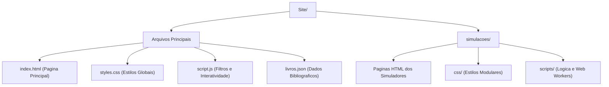

# Simulações Educacionais de Física e Matemática

Repositório dedicado ao desenvolvimento de simulações interativas para o ensino e aprendizagem de conceitos de física e matemática.

**Acesse o site online via GitHub Pages:** [https://nicolas-heringer.github.io/Site/](https://nicolas-heringer.github.io/Site/)

---

## Sobre o Projeto

Este projeto tem como objetivo fornecer ferramentas visuais e interativas para explorar fenômenos físicos e formulações matemáticas. O repositório e a página são atualizados de forma contínua para adicionar novas simulações, funcionalidades e melhorias na interface.

A estrutura do projeto é modular: cada simulação é encapsulada em seu próprio arquivo HTML e conta com arquivos dedicados de estilo (CSS) e lógica (JavaScript). Esse formato facilita a manutenção e a inclusão de novos módulos sem interferir nas demais simulações.

---

## Simulações Disponíveis

- **Átomo de Hidrogênio:** Visualização dos autovalores (energias) e autovetores (estados quânticos).
- **Áudio Fourier:** Análise de ondas sonoras e decomposição no espectro de frequências via transformada de Fourier.
- **Fônons:** Visualização de ondas de matéria e modos vibracionais em uma rede cristalina.
- **Lei de Snell:** Simulação de refração e reflexão da luz em meios com diferentes índices de refração.
- **Ondas Estacionárias 2D:** Visualização de padrões de interferência bidimensionais (padrões de Chladni).
- **Queda Livre:** Simulação interativa de cinemática sob aceleração gravitacional.
- **Modelo de Drude:** Representação microscópica da condução elétrica clássica interagindo com uma rede cristalina.
- **Movimento em 1D e 2D:** Análise gráfica e dinâmica de corpos em movimento retilíneo e encontro de corpos.
- **Simulação de Partículas:** Interação coulombiana e dinâmica de sistemas de partículas.
- **Matrizes 2D:** Interpretação geométrica de matrizes 2x2, deformação do espaço e cálculo de determinante.
- **Tensor de Inércia:** Visualização dos eixos principais e cálculo do tensor de inércia.
- **Gravidade:** Dinâmica orbital e atração gravitacional entre corpos.

---

## Estrutura do Projeto



<details>
<summary><strong>Ver relacao completa de arquivos</strong></summary>

```text
Site/
│
├── favicon.svg
├── index.html
├── livros.json
├── README.md
├── script.js
├── styles.css
│
└── simulacoes/
    ├── atomo_de_hidrogenio.html
    ├── audio.html
    ├── drude.html
    ├── estacionarias2d.html
    ├── fonons.html
    ├── gravidade.html
    ├── matrizes.html
    ├── movimento.html
    ├── particulas.html
    ├── quedalivre.html
    ├── snell.html
    ├── tensor_de_inercia.html
    │
    ├── css/
    │   ├── atomo_de_hidrogenio.css
    │   ├── base.css
    │   ├── buttons.css
    │   ├── drude.css
    │   ├── fonons.css
    │   ├── gravidade.css
    │   ├── matrizes.css
    │   ├── movimento.css
    │   ├── particulas.css
    │   ├── quedalivre.css
    │   ├── snell.css
    │   └── tensor_de_inercia.css
    │
    └── scripts/
        ├── atomo_de_hidrogenio.js
        ├── audio.js
        ├── buttons.js
        ├── drude.js
        ├── estacionarias2d.js
        ├── fonons.js
        ├── gravidade.js
        ├── matrizes.js
        ├── movimento.js
        ├── particulas.js
        ├── quedalivre.js
        ├── snell.js
        ├── snell.worker.js
        └── tensor_de_inercia.js
```

</details>

---

## Tecnologias Utilizadas

- **HTML5:** Estruturação semântica, Canvas API e Web Audio API.
- **CSS3:** Estilização modular, temas e layouts responsivos.
- **JavaScript (ES6+):** Lógica computacional, renderização gráfica e processamento paralelo com Web Workers.

---

## Como Executar Localmente

1. Clone o repositório:
   ```bash
   git clone https://github.com/Nicolas-Heringer/Site.git
   ```

2. Acesse o diretório do projeto:
   ```bash
   cd Site
   ```

3. Inicie um servidor local. Minha alternativa recomendada para rodar localmente de forma rápida é utilizar o próprio Python:
   ```bash
   python -m http.server 8080
   ```
   Depois, basta abrir o navegador e acessar `http://localhost:8080`.

   Alternativamente, você também pode abrir o arquivo `index.html` diretamente no navegador ou utilizar extensões como o *Live Server* do VS Code.

---

## Autor

**Nicolas Heringer**

- GitHub: [Nicolas-Heringer](https://github.com/Nicolas-Heringer)
- LinkedIn: [nicolasheringer](https://www.linkedin.com/in/nicolasheringer/)
- Instagram: [@nicolasheringer](https://www.instagram.com/nicolasheringer/)
